# 操作系统原理及Linux实践

## 一、导论

* Bootstrap of computer

    1. 打开电源
    2. CPU将控制权交给BIOS（基本输⼊输出系统，存放在CMOS中） 
    3. BIOS运⾏⼀个程序：通电⾃测试程序 
    4. BIOS确认所有外部设备：硬盘或扩充卡 
    5. BIOS找到磁盘的引导区，将其中的主引导程序bootloader装⼊内存。（主引导程序时⼀段代码， 它可以将OS余下部分装⼊内存） 
    6. 引导操作系统结束，操作系统接管计算机 
    7. 操作系统等待事件发⽣.......

* 中断

    当有事件（Event）发⽣时，CPU会收到⼀个中断（Interrupt）信号，可以是硬中断也可以是软中断

    CPU会停下正在做的事，转⽽执⾏中断处理程序，执⾏完毕会回到之前被中断的地⽅继续执⾏

    Operating System is an Interrupt driven system （操作系统是⼀个由中断驱动的系统）

* 存储系统

    CPU负责将指令（Instruction）从内存（Memory）读⼊，所以程序必须在内存中才能运⾏
    
    内存以字节为存储单位，每个字节都有⼀个地址与之对应。通过load/store指令即可访问地址的内存数据
    
    * load：将内存输⼊读⼊到寄存器
    * store：将寄存器数据写⼊到内存

    * 存储层次图

        易失性存储 volatile memory
        
        * register 寄存器
        * cache 缓存
        * main memory 内存
        
        非易失性存储 nonvolatile memory
        
        * solid-state disk SSD
        * magnetic disk 磁盘
        * optical disk 光盘
        * magnetic tapes 磁带
 
* 处理器系统

    * 单处理器系统 - single-processor system
        * 只有一颗主CPU执行通用指令集
        * 一般带有其他专用处理器，这些处理器不处理用户进程（如处理键盘输入的专用处理器）
        * 操作系统对专用处理器会发出任务、并监控它们的状态
    * 多处理器系统 - multiprocessor/multicore system
        * 两个/多个紧密通信的CPU共享总线、时钟、内存和外设等
        * 非对称结构 - 分主/从处理器 Asysmmetric Mutliprocessting
        * 对称结构 - Symmetric Multiprocessing, SMP
    * 集群系统 - clustered system
        * 该系统由若⼲节点（Node）通过⽹络连接在⼀起，每个节点可为单处理器系统或多处理器系统，节点之间是松耦合（loosely coupled）关系
        * ⾼可⽤性（high availability）
        * ⾼性能计算（high-performance computing）

* 操作系统结构

    * 单用户单道模式 - CPU利用率低
    * 多道程序设计 - 通过合理安排任务，使CPU总有一个执行任务，从而提高CPU利用率
        硬件保障： 处理器和IO设备具备并行工作的能力
    * 分时系统 - time sharing 多任务系统（multi-tasking）
        * 允许多个用户共享一台计算机
        * 用户只有输入输出设备
        * 为每个用户轮流分配等量的CPU时间
        * 响应时间 - 发出指令到得到及时结果
        * 第一个分时系统 - CTSS（MIT）


## 二、操作系统结构

* 操作系统的服务
    
    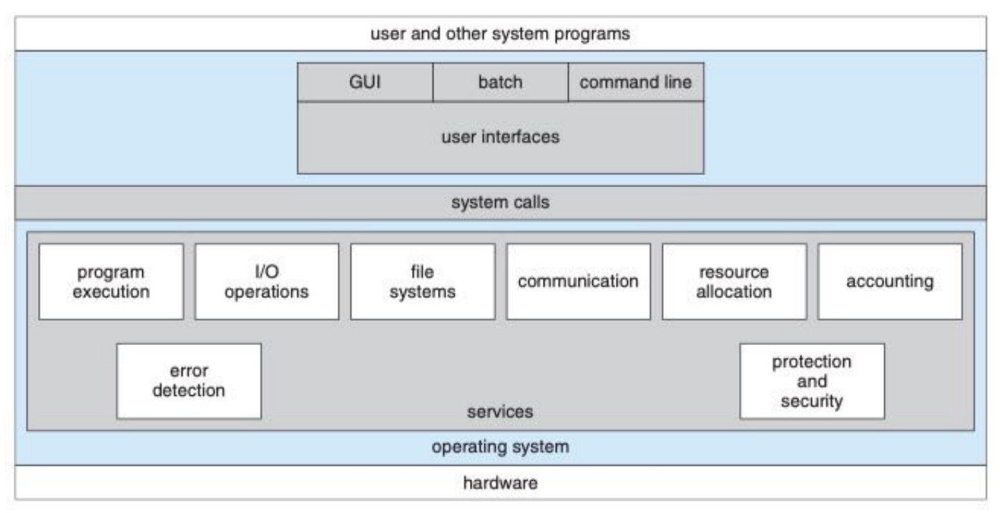

    * USER INTERFACE - `for user`
        Almost all operating system have a user interface(UI). It offers a way for users to interface with OS.
        * CLI(Command Line Interface) 
            command interpreter(shell) 
        * GUI(Graphic User Interface) 
            A user friendly graphical user interface. 
        * Batch 
            It is a file which contains commands and directives. 

    * 系统调用（SYSTEM CALLS）- `for developer`

        系统调用提供了访问和使用操作系统所提供的服务的接口。 

        * 系统调用的实现代码是操作系统级的 
        * 这个接口通常是面向程序员的 

        API (Application Programming Interface)：指明了参数和返回值的一组函数。 

        * 应用程序App的开发人员通过透过API间接访问了系统调用 
        * Windows API / POSIX API / JAVA API

        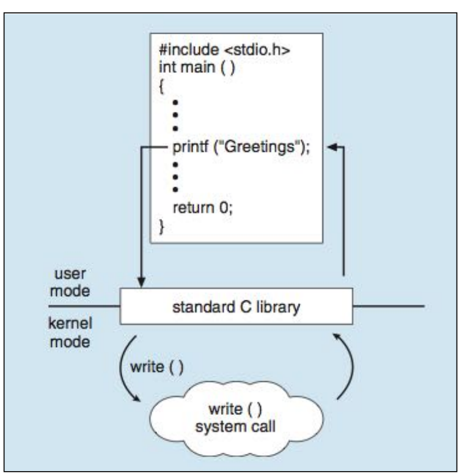

        printf是standard C library提供的API; printf函数的调用引发了对应的系统调用write的执行, write执行结束时的返回值传递回用户程序

    * 双重模式（DUAL MODE）

        现代计算机系统有一个特殊的硬件，用于划分系统的运行状态，至少需要两种单独运行模式： 
        
        * 用户模式（user mode）：执行用户代码 
        * 内核模式（kernel mode）：执行操作系统代码 

        目的：确保操作系统正确的运行 

        实现方式: 用一个硬件模式位来表示当前模式：0表示内核模式，1表示用户模式

    * TRAP MECHANISM

        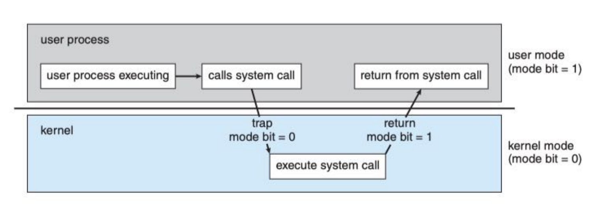
    
    * 系统调用的实现机制

        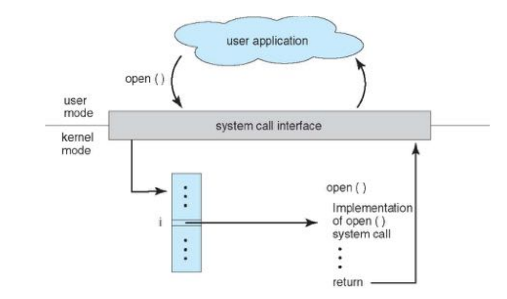

        每个系统调用都有一个唯一的数字编号，被称为系统调用号

        用户代码调用API时，API中会向系统调用接口指明其所要用的系统调用号，操作系统内核中维护了一张索引表，依据这个调用号可以检索到访系统调用代码在内核中的位置。

* 操作系统的构建方式

    * 操作系统的设计思路
        * 设计目标: 
            * 用户目标（user goal）
            * 系统目标（system goal） 
        * 机制与策略的分离
            * 机制（mechanism）：如何做 （如：要用多任务）
            * 策略（policy）：做什么 （如：怎么多任务）
        * 微内核操作系统Mach、Darwin - 只确定机制，而策略可通过类似模板等加载

## 三、进程 - 概念

Process concept

* 进程的定义

    * 程序和进程
        
        A program is a passive entity (被动实体), such as a file containing a list of instructions stored on disk(often called an executable file). 

        A program becomes a process when an executable file is loaded into memory. 

        A process is an active entity, with a program counter (程序计数器, `PC`) specifying the next instruction to execute an a set of associated resources.
    
    * 程序计数器（PC）

        程序计数器（PC）是一个CPU中的寄存器，里面**存放下一条要执行指令的内存地址**，在Intel x86 和 Itanium 微处理器中，它叫做指令指针（Instruction Pointer，IP），有时又称为指令地址寄存器（instruction address register，IAR）、指令计数器。 

        通常，CPU在取完一条指令之后会将PC寄存器的值加“1”，以计算下条要执行指令的地址

    * process in memory 

        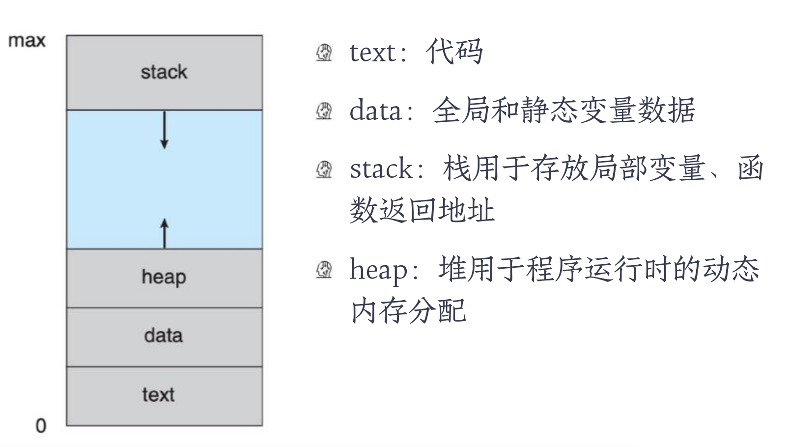

    * 并发

        Concurrency：the fact of two or more events or circumstances **happening or existing** at the same time.

        并行：running at the same time

        ```text
        并行：               并发：
          ^    ^            +------------------------------+
          |    |            | A ---.........---Finished    |
          |    |            | B ......---......---Finished |
        --+----+--          | C ...---...---Finished       |   "..." 表示在等待CPU
          A    B            +------------------------------+   "---" 表示正在使用CPU
        ```

        进程并发的动机：多道程序设计

        为什么不叫“并行的进程”？

        * 并发进程可能无法一次性执行完毕，会走走停停
        * 一个进程在执行过程中可能会被另一个进程替换占有CPU，这个过程称作 “进程切换”。

    * 进程的定义

        * 进程是一个程序的一次执行过程 
            * 能完成具体的功能 
            * 是在某个数据集合上完成的 
            * 执行过程是可并发的 
        * 进程是资源分配、保护和调度的基本单位

* 进程的状态

    进程在执行期间自身的状态会发生变化，进程有三种基本状态，分别是：

    **运行态**（`Running`）：此时进程的代码在CPU上运行 

    **就绪态**（`Ready`）：进程具备运行条件，等待分配CPU 

    **等待态**（`Waiting`）：进程在等待某些事件的发生（比如 IO操作结束 或者 一个信号，此时进程不具备运行条件）

    * 进程何时离开CPU

        * 内部事件 
            
            进程主动放弃(`yield`)CPU，进入等待/终止状态。 
            
            E.g. 使用I/O设备，(非)正常结束。 
        
        * 外部事件 

            进程被剥夺CPU使用权，进入就绪状态。这个动作叫抢占(`preempt`)。

            E.g. 时间片到达; 高优先权进程到达。
        
    * 进程状态转换图

        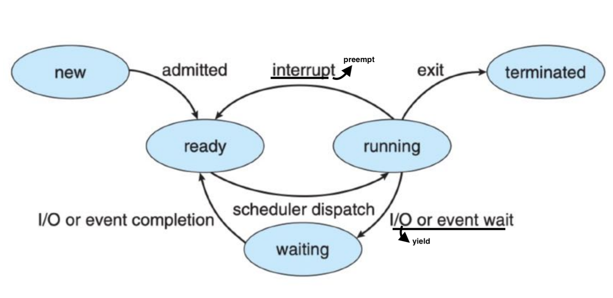

## 四、进程 - 调度

* 进程切换

    并发进程的切换 - 被另外一个今晨抢占CPU

    * 是什么触发了进程切换？
    * 进程切换时要做什么？

    * 中断技术

        中断是指程序**执行过程**中，当**发生某个事件**时，**中止CPU上现行程序的运行**，引出该事件的**处理程序执行**，执行完毕**返回原程序中断点继续执行**

        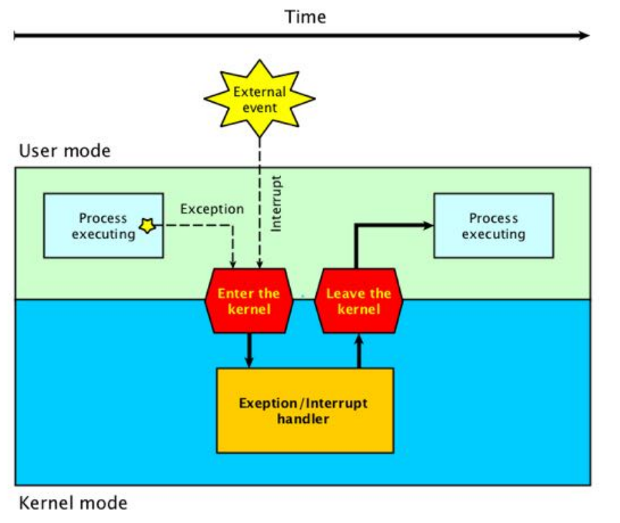

        * 中断源

            * 外中断：来自处理器之外的硬件中断信号 
                * 如时钟中断、键盘中断、外围设备中断 
                * 外部中断均是**异步中断** 
            * 内中断（异常 Exception）：来自于处理器内部，指令执行过程中发生的中断，属**同步中断** 
                * 硬件异常：掉电、奇偶校验错误等 
                * 程序异常：非法操作、地址越界、断点、除数为0 
                * 系统调用

        * 同步/异步中断

            同步中断 - 指当前指令执行时由CPU控制单元产生的中断。同步中断只有在一条指令执行完毕后，cpu才会发生中断，而不是代码执行期间（如系统调用）

            异步中断 - 中断可发生在指令执行之间（如键盘中断）

        * 中断处理过程

            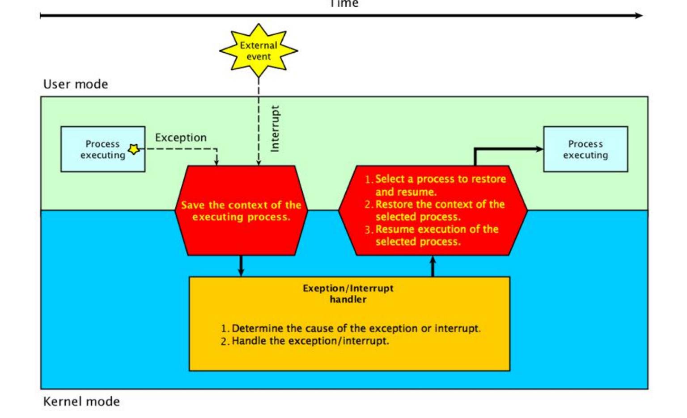

    * 特权指令和非特权指令

        * **Privileged Instructions** - The Instructions that can run only in **Kernel Mode** are called Privileged Instructions . 
            * I/O instructions and Halt instructions
            * Turn off all Interrupts 
            * Set the Timer 
            * Process Switching 
        * **Non-Privileged Instructions** - The Instructions that can run only in **User Mode** are called Non-Privileged Instructions

    * 模式切换

        中断是用户态向核心态转换的唯一途径！系统调用实质上也是一种中断。 

        OS提供Load PSW指令装载用户进程返回用户状态

        

    * 进程切换

        切换时机:

        * 进程需要进入等待状态 
        * 进程被抢占CPU而进入就绪状态 

        切换过程:

        * 保存被中断进程的上下文信息（Context) 
        * 修改被中断进程的控制信息（如状态等） 
        * 将被中断的进程加入相应的状态队列 
        * 调度一个新的进程并恢复它的上下文信息

* 进程调度
    
    * 进程控制块 - PCB, process control block

        A Process Control Block（PCB）contains many pieces of information associated with a specific process.

        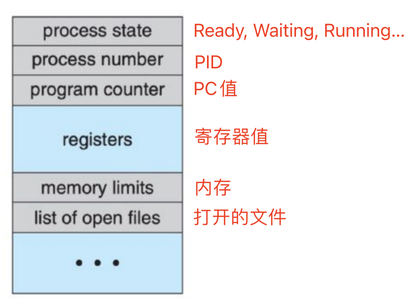
    
    * 进程在物理内存

        离散存放：

        目的 - 避免内存连续性对管理产生的影响（后续阐述）

        问题 - 需要额外的 translation map 记录

        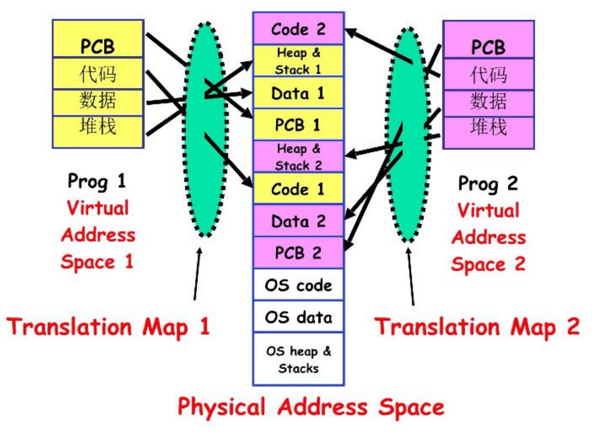
    
    * 进程队列 - process queue

        是 PCB 队列，而不是完整进程

        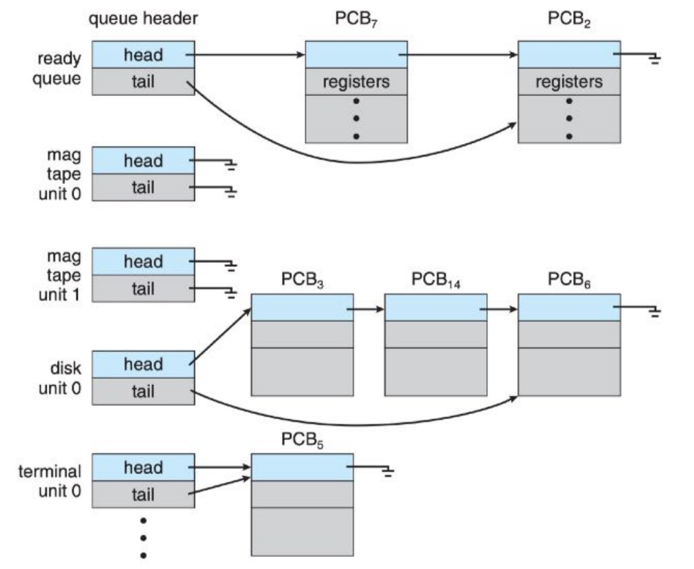

    * 进程调度 - process schedule

        进程在整个生命周期中会在各个调度队列中迁移，由操作系统的一个调度器（scheduler）来执行

        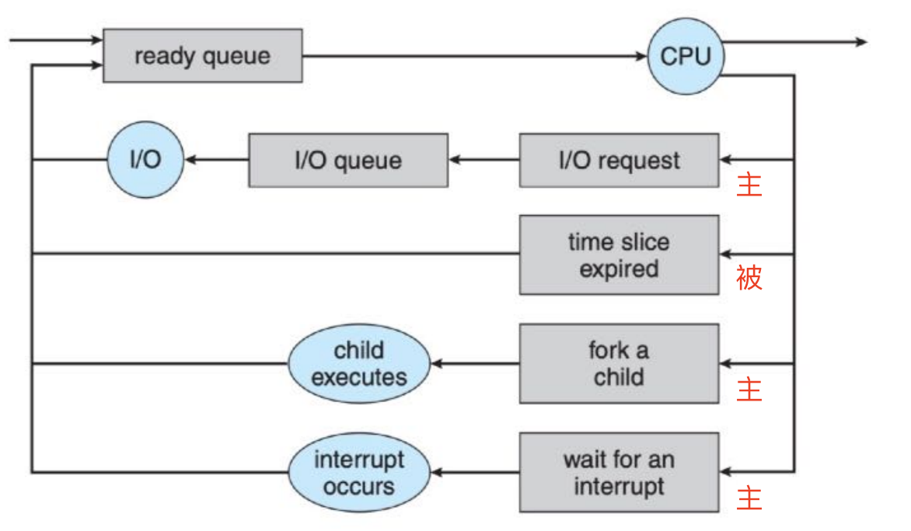
        
## 实验二

* 创建多线程


```c
#include <stdio.h>
#include <sys/types.h>
#include <unistd.h>
#include <pthread.h>
#include <time.h>
#include <stdlib.h>

void* hello() {
	for (int i = 0; i < 30; ++i) {
		printf("Hello(%d)\n", rand() % 100);
	}
}

void* world() {
	for (int i = 0; i < 30; ++i) {
		printf("World(%d)\n", rand() % 100);
	}
}

int main() {
	srand(time(NULL));
	pthread_t tid, tid2;
	pthread_create(&tid, NULL, hello, NULL);
	pthread_create(&tid2, NULL, world, NULL);
	pthread_join(tid, NULL);
	pthread_join(tid2, NULL);
	return 0;
}
```

* Monte Carlo 技术计算 PI 值（多线程）

    * 普通实现

        ```c
        #include <stdio.h>
        #include <sys/types.h>
        #include <unistd.h>
        #include <pthread.h>
        #include <time.h>
        #include <stdlib.h>

        int intervals = 1000;

        int main(int argc, char const* argv[]) {
            clock_t start, delta;
            
            start = clock();

            srand(time(NULL));

            int circle_points = 0;
            int square_points = 0;
            double pi;

            for (int i = 0; i < intervals*intervals; ++i) {
                double rand_x = (double)rand() / RAND_MAX;
                double rand_y = (double)rand() / RAND_MAX;

                if ((rand_x * rand_x + rand_y * rand_y) <= 1) {
                    circle_points++;
                }
                
                square_points++;
            }

            pi = (double)(4.0 * circle_points) / square_points;
            printf("circle points: %d, square points: %d, => PI: %lf\n", circle_points, square_points, pi);

            delta = clock() - start;
            printf("Time taken: %lf seconds\n", (double)delta / CLOCKS_PER_SEC);
            return 0;
        }
        ```

    * 多次计算

        ```c
        #include <stdio.h>
        #include <sys/types.h>
        #include <time.h>
        #include <stdlib.h>
        #include <unistd.h>
        #include <pthread.h>


        void calc_pi(int intervals) {
            unsigned int seed = time(NULL);
            int circle_points = 0;
            int square_points = 0;

            for (int i = 0; i < intervals*intervals; ++i) {
                double rand_x = (double)rand() / RAND_MAX;
                double rand_y = (double)rand() / RAND_MAX;

                if ((rand_x * rand_x + rand_y * rand_y) <= 1) {
                    circle_points++;
                }
                
                square_points++;
            }

            double pi;
            pi = (double)(4.0 * circle_points) / square_points;
            printf("circle points: %d, square points: %d, => PI: %lf\n", circle_points, square_points, pi);
        }


        int main(int argc, char const* argv[]) {
            clock_t start, delta;
            int intervals = 1000;

            start = clock();

            for (int i = 0; i < 10; ++i) {
                calc_pi(1000);
            }

            delta = clock() - start;
            printf("Time taken: %lf seconds\n", (double)delta / CLOCKS_PER_SEC);
            return 0;
        }
        ```
    
    * 多线程计算

        ```c
        #include <stdio.h>
        #include <sys/types.h>
        #include <time.h>
        #include <stdlib.h>
        #include <unistd.h>
        #include <pthread.h>

        void* calc_pi(void* arg) {
            unsigned int seed = time(NULL);
            int circle_points = 0;
            int square_points = 0;
            int intervals = *((int*)arg);  //参数传递

            for (int i = 0; i < intervals * intervals; ++i) {
                double rand_x = (double)rand() / RAND_MAX;
                double rand_y = (double)rand() / RAND_MAX;

                if ((rand_x * rand_x + rand_y * rand_y) <= 1) {
                    circle_points++;
                }

                square_points++;
            }

            double pi;
            pi = (double)(4.0 * circle_points) / square_points;
            printf("circle points: %d, square points: %d, => PI: %lf\n", circle_points, square_points, pi);

            pthread_exit(0); //The thread finish normally or abnormally
        }


        int main(int argc, char const* argv[]) {
            clock_t start, delta;
            int intervals = 1000;
            const int THREAD_N = 10;

            start = clock();

            pthread_t cacl_pi_thread[10];
            int args[10];

            for (int i = 0; i < THREAD_N; ++i) {
                args[i] = intervals;
                pthread_create(cacl_pi_thread + i, NULL, calc_pi, args + i);
            }

            for (int i = 0; i < THREAD_N; ++i) {
                pthread_join(cacl_pi_thread[i], NULL);
            }

            delta = clock() - start;
            printf("Time taken: %lf seconds\n", (double)delta / CLOCKS_PER_SEC);
            return 0;
        }
        ```